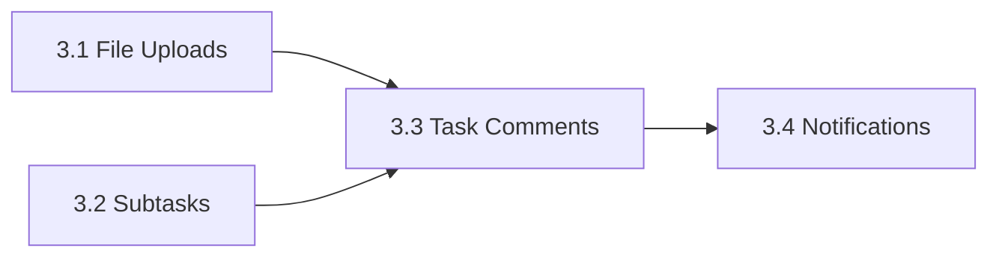

# Sprint 3 Checklist

**Started:** 2026-07-04
**Target:** 4 features for a 4-person team (~2 weeks)

## Features

- [ ] **Story 3.1: File Uploads (Supabase)** — 3 days
- [ ] **Story 3.2: Task Subtasks & Dependencies** — 4 days
- [ ] **Story 3.3: Task Comments** — 3 days
- [ ] **Story 3.4: In-App Notifications** — 5 days

## Dependencies

- 3.4 (Notifications) depends on 3.3 (Comments) for @mention events
- 3.3 (Comments) is independent but naturally follows subtasks
- 3.1 (Uploads) and 3.2 (Subtasks) are fully independent — can be built in parallel

## Team Assignment Ideas

| Person | Stories | Notes |
|--------|---------|-------|
| Dev A | 3.1 File Uploads + 3.2 Subtasks | Backend-heavy to start |
| Dev B | 3.3 Comments + 3.4 Notifications | Frontend-heavy to start |
| Dev C/D | Split across both tracks | QA, integration, edge cases |

## Completion

- [ ] Release: all 4 features deployed to production
- [ ] Retrospective completed
