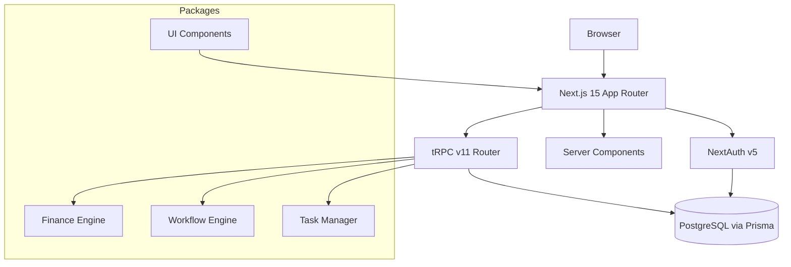
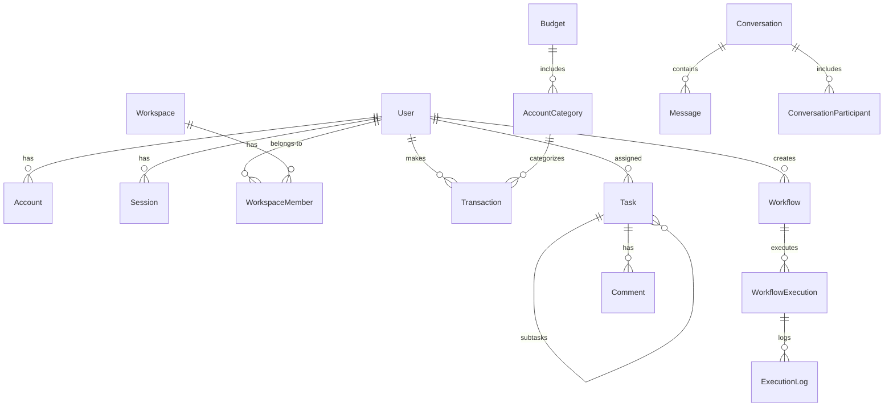

# ARKO Architecture

## System Design

## Data Model

## Key Decisions

| Decision | Choice | Rationale |
|---|---|---|
| Monorepo | Turborepo + pnpm | Shared packages, consistent tooling |
| API layer | tRPC v11 | End-to-end type safety, no codegen |
| Auth | NextAuth v5 Credentials | Simple password-based auth, JWT sessions |
| Database ORM | Prisma | Type-safe queries, migrations, studio |
| Styling | Tailwind CSS v4 | Utility-first, fast iteration |
| State | Server Components + React Query | Minimize client JS, cache on server |

## Deployment

- **Database**: PostgreSQL (local dev → Supabase)
- **Hosting**: Vercel (planned)
- **File storage**: S3-compatible (MinIO local → Supabase Storage planned)
