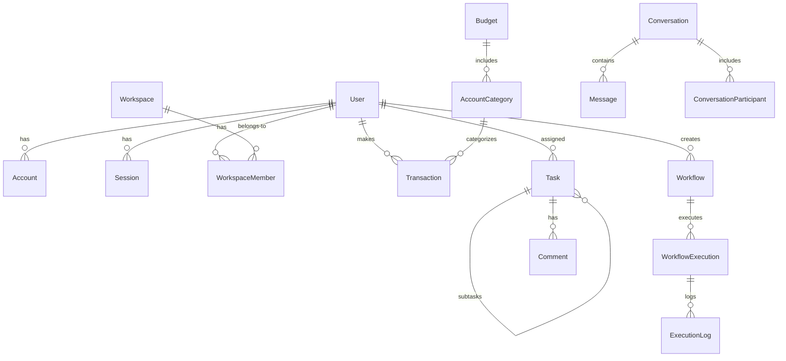

# ARKO Architecture

## System Design

```mermaid
graph TD
    Browser[Browser] --> Vercel[Vercel Edge]
    Vercel --> SPA[React SPA (Vite)]
    Vercel --> API[Django Serverless WSGI]
    
    SPA --> APIClient[API Client (fetch)]
    APIClient --> API
    
    API --> AuthJWT[JWT Authentication]
    API --> DRF[Django REST Framework]
    
    DRF --> Tasks[Tasks App]
    DRF --> Finance[Finance App]
    DRF --> Messages[Messages App]
    DRF --> Notes[Notes App]
    DRF --> Reminders[Reminders App]
    DRF --> Users[Users App]
    
    Tasks --> DB[(Neon PostgreSQL)]
    Finance --> DB
    Messages --> DB
    Notes --> DB
    Reminders --> DB
    Users --> DB
    
    subgraph Local Dev
        Docker[Docker Compose]
        Docker --> Pg[(Postgres 16)]
        Docker --> MinIO[S3 (MinIO)]
        Docker --> MH[MailHog]
    end
    
    subgraph Production
        DB
        SupaStorage[S3 (Supabase Storage)]
    end
```

## Data Model


```mermaid
erDiagram
    User ||--o{ Account : has
    User ||--o{ Session : has
    User ||--o{ WorkspaceMember : belongs-to
    User ||--o{ Transaction : makes
    User ||--o{ Task : assigned
    User ||--o{ Workflow : creates
    
    Workspace ||--o{ WorkspaceMember : has
    AccountCategory ||--o{ Transaction : categorizes
    Budget ||--o{ AccountCategory : includes
    
    Workflow ||--o{ WorkflowExecution : executes
    WorkflowExecution ||--o{ ExecutionLog : logs
    
    Task ||--o{ Comment : has
    Task ||--o{ Task : subtasks
    
    Conversation ||--o{ Message : contains
    Conversation ||--o{ ConversationParticipant : includes
```

## Key Decisions

| Decision | Choice | Rationale |
|---|---|---|
| Frontend | Vite + React 19 | Lightweight SPA, fast HMR, no SSR complexity |
| Backend | Django 6 + DRF | Mature ORM, admin interface, JWT auth via SimpleJWT |
| API layer | Django REST Framework + JWT | Type-safe serializers, browsable API, token auth |
| Database | PostgreSQL (Neon) | Serverless Postgres with IPv4 + IPv6, free tier |
| Hosting | Vercel | Both static SPA and Python serverless on one platform |
| ORM | Django ORM | Native Django, migrations built in |
| Styling | Tailwind CSS v4 | Utility-first, consistent design system |
| State | React Query (TanStack Query) | Server state caching, invalidation, mutations |

## Deployment Architecture

```
Vercel (arko-internal-system.vercel.app)
├── / (root)          → Vite React SPA (frontend/dist/)
├── /api/*            → Django WSGI serverless function (api/index.py)
│
Backing Services:
├── Neon Postgres     → Database (ap-southeast-2)
└── Supabase Storage  → File storage (S3-compatible API)
```

### How API routing works

1. Vercel rewrites `/{path}` → `index.html` (SPA handles all client routes)
2. Vercel rewrites `/api/{path}` → `api/index.py` serverless function
3. `api/index.py` loads Django WSGI app with production settings (`config.production`)
4. Django routes the request through URL dispatcher

### Django settings split

- **`config/settings.py`** — Local dev: Docker Postgres (`localhost:5434`), MinIO, MailHog
- **`config/production.py`** — Production: Neon Postgres via `DATABASE_URL`, Supabase Storage, locked CORS
