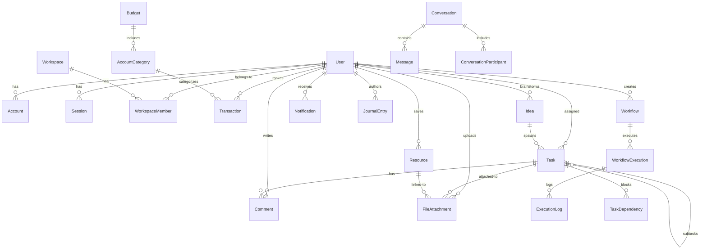

# ARKO Architecture

## System Design

```mermaid
graph TD
    Browser[Browser] --> Vercel[Vercel Edge]
    Vercel --> SPA[React SPA (Vite)]
    Vercel --> API[Django Serverless WSGI]
    
    SPA --> APIClient[API Client (fetch)]
    APIClient --> API
    
    API --> AuthJWT[JWT Authentication]
    API --> DRF[Django REST Framework]
    
    DRF --> Tasks[Tasks App]
    DRF --> Finance[Finance App]
    DRF --> Messages[Messages App]
    DRF --> Notes[Notes App]
    DRF --> Reminders[Reminders App]
    DRF --> Users[Users App]
    DRF --> Events[Events & Sprints]
    DRF --> Storage[Storage / File Uploads]
    DRF --> Comments[Comments App]
    DRF --> Notifications[Notifications App]
    DRF --> Journal[Journal App]
    DRF --> Ideas[Ideas App]
    DRF --> Resources[Resources App]
    
    Tasks --> DB[(Neon PostgreSQL)]
    Finance --> DB
    Messages --> DB
    Notes --> DB
    Reminders --> DB
    Users --> DB
    Events --> DB
    Comments --> DB
    Notifications --> DB
    Journal --> DB
    Ideas --> DB
    Resources --> DB
    
    Storage --> S3[Supabase Storage / S3]
    
    subgraph Local Dev
        Docker[Docker Compose]
        Docker --> Pg[(Postgres 16)]
        Docker --> MinIO[S3 (MinIO)]
        Docker --> MH[MailHog]
    end
    
    subgraph Production
        DB
        S3
    end
```

## Data Model


```mermaid
erDiagram
    User ||--o{ Account : has
    User ||--o{ Session : has
    User ||--o{ WorkspaceMember : belongs-to
    User ||--o{ Transaction : makes
    User ||--o{ Task : assigned
    User ||--o{ Workflow : creates
    User ||--o{ Comment : writes
    User ||--o{ Notification : receives
    User ||--o{ JournalEntry : authors
    User ||--o{ Idea : brainstorms
    User ||--o{ Resource : saves
    User ||--o{ FileAttachment : uploads
    
    Workspace ||--o{ WorkspaceMember : has
    AccountCategory ||--o{ Transaction : categorizes
    Budget ||--o{ AccountCategory : includes
    
    Workflow ||--o{ WorkflowExecution : executes
    WorkflowExecution ||--o{ ExecutionLog : logs
    
    Task ||--o{ Comment : has
    Task ||--o{ Task : subtasks
    Task ||--o{ TaskDependency : blocks
    Task ||--o{ FileAttachment : attached-to
    
    Conversation ||--o{ Message : contains
    Conversation ||--o{ ConversationParticipant : includes
    
    Idea ||--o{ Task : spawns
    
    Resource ||--o{ FileAttachment : linked-to
```

## Key Decisions

| Decision | Choice | Rationale |
|---|---|---|
| Frontend | Vite + React 19 | Lightweight SPA, fast HMR, no SSR complexity |
| Backend | Django 6 + DRF | Mature ORM, admin interface, JWT auth via SimpleJWT |
| API layer | Django REST Framework + JWT | Type-safe serializers, browsable API, token auth |
| Database | PostgreSQL (Neon) | Serverless Postgres with IPv4 + IPv6, free tier |
| Hosting | Vercel | Both static SPA and Python serverless on one platform |
| ORM | Django ORM | Native Django, migrations built in |
| Styling | Tailwind CSS v4 | Utility-first, consistent design system |
| State | React Query (TanStack Query) | Server state caching, invalidation, mutations |
| File Storage | S3 (Supabase/MinIO) | S3-compatible, works in production and local dev |

## Sprint 3 & 3.5 Architecture Notes

### Generic Comment System
Comments are attached to any resource type via a `resource_type` + `resource_id` pair — no polymorphic FK needed. This keeps queries simple and lets comments work on tasks, ideas, notes, etc. without schema changes.

### Notification Signals
The `notifications_app` uses Django's `post_save` signal system to auto-generate notifications when:
- A comment is added to a task (notifies the assignee)
- A task is assigned (notifies the new assignee)

This decouples notification logic from business logic.

### Idea → Task Spawning
The `ideas_app` can create a task from an idea with a single API call. The idea stores the spawned `task_id` for cross-referencing, and the task inherits the idea's title and description.

### File Uploads
The `storage_app` abstracts S3-compatible storage behind a simple upload/download/delete API. Falls back to local filesystem when S3 isn't configured (local dev).

## Deployment Architecture

```
Vercel (arko-internal-system.vercel.app)
├── / (root)          → Vite React SPA (frontend/dist/)
├── /api/*            → Django WSGI serverless function (api/index.py)
│
Backing Services:
├── Neon Postgres     → Database (ap-southeast-2)
└── Supabase Storage  → File storage (S3-compatible API)
```

### How API routing works

1. Vercel rewrites `/{path}` → `index.html` (SPA handles all client routes)
2. Vercel rewrites `/api/{path}` → `api/index.py` serverless function
3. `api/index.py` loads Django WSGI app with production settings (`config.production`)
4. Django routes the request through URL dispatcher

## Auth & Permission Model

### Role-based admin access

Admin endpoints use a custom `IsRoleAdmin` permission class that checks the `role` field directly (`role == 'ADMIN'`) rather than Django's built-in `IsAdminUser` (which checks `is_staff`):

```python
class IsRoleAdmin(BasePermission):
    def has_permission(self, request, view):
        return bool(request.user and request.user.is_authenticated
                    and getattr(request.user, 'role', None) == 'ADMIN')
```

This decouples admin authorization from `is_staff` so that:
- Creating an admin user automatically syncs `is_staff = True` (done in the view, not the serializer)
- The `role` field is always the source of truth
- The JWT token carries the user profile (including `role`) returned by `/api/auth/me/`

### Authorization flow

1. User logs in → receives JWT + user profile (includes `role`)
2. Frontend checks `user.role === 'ADMIN'` to show/hide admin UI (nav items, buttons)
3. API requests use Bearer token → backend verifies JWT → `IsRoleAdmin` checks `request.user.role`
4. All 4 admin endpoints (`list`, `create`, `update`, `delete`) use `IsRoleAdmin`

### Django settings split

- **`config/settings.py`** — Local dev: Docker Postgres (`localhost:5434`), MinIO, MailHog
- **`config/production.py`** — Production: Neon Postgres via `DATABASE_URL`, Supabase Storage, locked CORS
